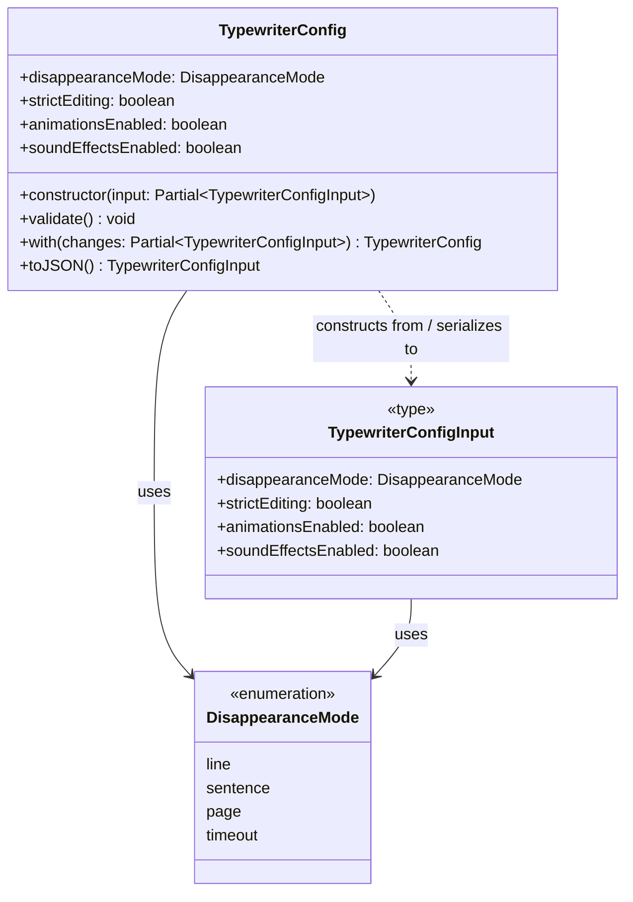

# TypewriterConfig — UML Diagram

## Defaults

| Field | Default |
|---|---|
| `disappearanceMode` | `"sentence"` |
| `strictEditing` | `true` |
| `animationsEnabled` | `true` |
| `soundEffectsEnabled` | `false` |

## Methods

| Method | Description |
|---|---|
| `constructor(input?)` | Creates a config from a partial input, filling missing fields with defaults. Calls `validate()`. |
| `validate()` | Throws if `disappearanceMode` is not a valid value (line, sentence, page, or timeout). |
| `with(changes)` | Returns a new `TypewriterConfig` with the given fields overridden. Immutable update pattern. |
| `toJSON()` | Serializes the config to a plain `TypewriterConfigInput` object. Used for localStorage persistence. |
